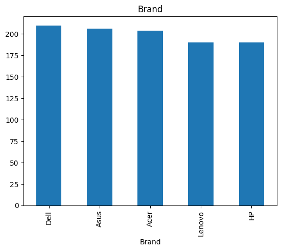
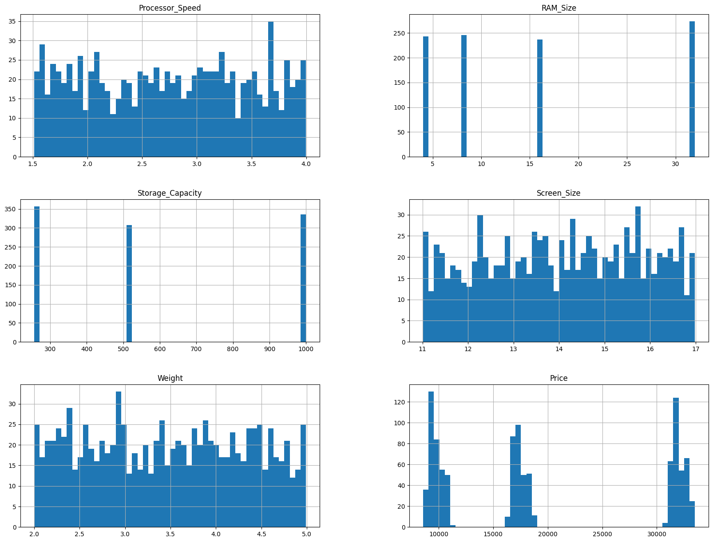
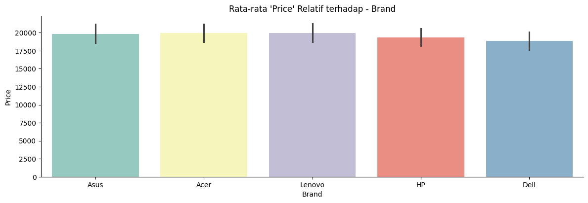
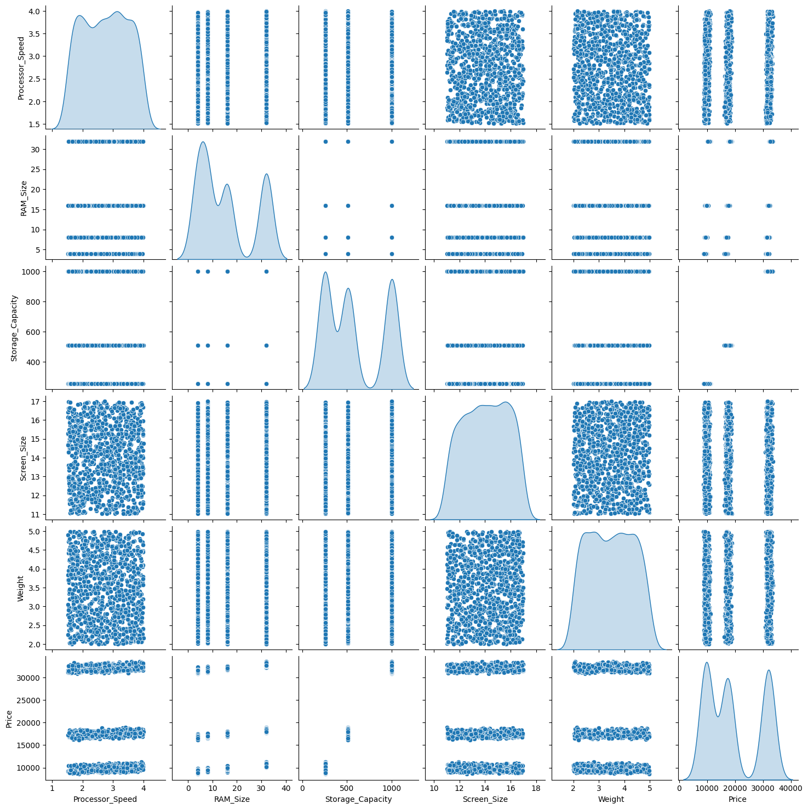
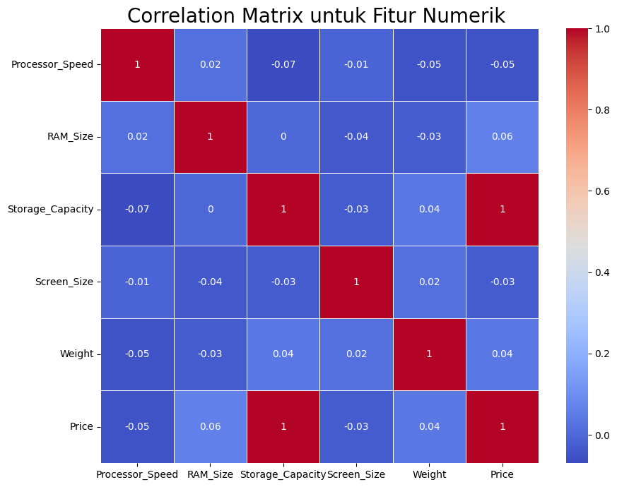
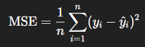
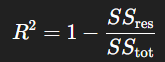
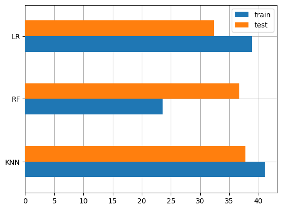
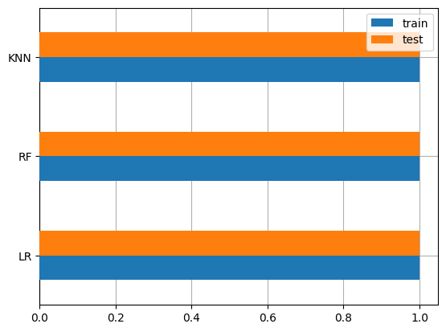

# Laporan Proyek Machine Learning - Nida'an Khafiyya

## Domain Proyek

Industri jual-beli laptop merupakan salah satu sektor teknologi yang berkembang pesat, didorong oleh meningkatnya kebutuhan masyarakat terhadap perangkat digital untuk keperluan pendidikan, pekerjaan, dan hiburan. Perusahaan yang berperan sebagai distributor maupun retailer laptop dihadapkan pada tantangan dalam menentukan harga beli dan jual yang kompetitif namun tetap menguntungkan. Tidak seperti produk komoditas standar, harga laptop sangat bervariasi tergantung pada kombinasi fitur seperti kecepatan prosesor, kapasitas RAM, kapasitas penyimpanan, ukuran layar, hingga merek. Kompleksitas ini membuat proses penentuan harga sulit jika hanya mengandalkan intuisi atau tren pasar, sehingga diperlukan pendekatan berbasis data untuk membantu proses pengambilan keputusan harga yang lebih akurat dan efisien.

Penelitian sebelumnya menunjukkan bahwa metode _multiple linear regression_ mampu memberikan tingkat akurasi prediksi harga laptop sebesar 81%, dengan mempertimbangkan variabel-variabel seperti model laptop, RAM, jenis penyimpanan, GPU, CPU, serta fitur tambahan seperti IPS Display dan Touchscreen [[1](https://www.academia.edu/download/79627922/V11I1202229.pdf)]. Hasil ini menunjukkan pentingnya pendekatan machine learning dalam membangun sistem prediksi harga laptop secara sistematis berdasarkan data. Oleh karena itu, proyek ini bertujuan untuk mengembangkan model prediksi harga laptop menggunakan algoritma supervised learning (seperti KNN, Random Forest, dan Linear Regression), didukung dengan teknik feature engineering serta evaluasi menggunakan metrik yang relevan, guna membantu perusahaan dalam menentukan harga beli ideal berdasarkan spesifikasi produk dan tetap menjaga margin keuntungan yang kompetitif.

Referensi: [Laptop Price Prediction using Machine Learning](https://www.academia.edu/download/79627922/V11I1202229.pdf) 

## Business Understanding

Bagian laporan ini mencakup:

### Problem Statements

Menjelaskan pernyataan masalah latar belakang:
- Fitur apa saja yang paling berpengaruh terhadap harga laptop?
- Berapa harga pasar sebuah laptop dengan fitur tertentu?
- Bagaimana cara meminimalkan kesalahan prediksi harga?

### Goals

Menjelaskan tujuan dari pernyataan masalah:
- Mengidentifikasi fitur-fitur (seperti RAM, brand, processor speed, storage, dll.) yang memiliki korelasi paling tinggi terhadap harga laptop.
- Membangun predictive model dengan performa terbaik untuk memprediksi harga laptop secara akurat.
- Memberikan rekomendasi harga beli optimal agar perusahaan tetap mendapatkan margin keuntungan yang kompetitif.

### Solution statements
- Membangun beberapa model machine learning untuk baseline dan perbandingan performa, seperti: K-Nearest Neighbor (KNN), Random Forest dan Linear Regression
- Melakukan feature engineering dan hyperparameter tuning menggunakan teknik seperti: GridSearchCV untuk optimasi parameter dan One-hot encoding untuk fitur kategorikal
- Menggunakan metrik evaluasi yang relevan seperti: MSE (Mean Squared Error) dan R² Score

## Data Understanding
Dataset yang digunakan dalam proyek ini merupakan data sintetis berjumlah 1000 data yang meniru harga laptop berdasarkan sejumlah fitur umum yang biasanya ditemukan dalam spesifikasi laptop. Dataset ini dikembangkan untuk keperluan pembelajaran dan eksperimen dalam pemodelan prediktif. Dataset mencakup informasi dari berbagai merek laptop serta fitur teknis utama yang sering dijadikan dasar pertimbangan harga.

Sumber Dataset: [Laptop Price Prediction](https://www.kaggle.com/datasets/mrsimple07/laptoppriceprediction).

### Variabel-variabel pada Laptop Price Prediction dataset adalah sebagai berikut:
- Brand (kategorical): Merek dari laptop. (Dell, HP, Lenovo, Asus, dan Acer).
- Processor_Speed (numerik): Kecepatan prosesor laptop dalam satuan GHz (1.5-4.0 Ghz).
- RAM_Size (numerik): Kapasitas RAM laptop (4GB, 8GB, 16GB, 32GB).
- Storage_Capacity (numerik): Kapasitas penyimpanan, bisa berupa (256GB, 512GB, 1000GB (1TB)).
- Screen_Size (numerik): Ukuran layar laptop dalam inci (11-17 inci).
- Weight (numerik): Berat laptop dalam kilogram (2.0-5.0 kg).
- Price (INR) (numerik): Harga laptop dalam satuan mata uang Rupee India, dihasilkan berdasarkan kombinasi fitur dengan penambahan noise acak untuk meniru variasi pasar.

### Kondisi Data
1. Missing Value
Missing value adalah data yang hilang atau tidak tercatat dalam dataset. Pada dataset ini, tidak ditemukan missing value, sehingga tidak diperlukan tindakan seperti imputasi atau penghapusan baris data.

    | Kolom      | Jumlah Missing Values |
    |----------------|---------|
    | Brand               | 0         |
    | Processor_Speed                     | 0         |
    | RAM_Size                   | 0         |
    | Storage_Capacity                  | 0         |
    | Screen_Size                        | 0         |
    | Weight                     | 0         |
    | Price                     | 0         |

2. Duplicated Data
Duplicated data adalah data yang memiliki baris yang identik atau berulang. Pada dataset ini, tidak ditemukan adanya duplikasi data, sehingga tidak diperlukan pembersihan lebih lanjut terkait data ganda.

    ```
    dataset.duplicated().sum()
    ```
    Kode di atas menunjukan adanya 0 data yang terduplikat. 

2. Outliner
Outlier adalah nilai data yang menyimpang secara ekstrem dari pola umum data lainnya. Deteksi outlier penting untuk menghindari pengaruh yang berlebihan terhadap model. Berdasarkan pemeriksaan visual (seperti menggunakan boxplot) dan analisis statistik, tidak ditemukan adanya outlier dalam dataset ini.

    Berikut ini merupakan rumus perhitungan IQR.
    
    IQR = Q3 - Q1
    
    Lower Bound = Q1 − 1.5 × IQR
    
    Upper Bound = Q3 + 1.5 × IQR

   

    Gambar tersebut menunjukkan boxplot dari fitur-fitur numerik seperti Processor_Speed, RAM_Size, Storage_Capacity, Screen_Size, Weight, dan Price, yang digunakan untuk mendeteksi outlier dalam data. Secara umum, distribusi data pada semua fitur tampak cukup simetris dengan sedikit outlier, menandakan sebaran data relatif normal dan konsisten.


### Exploratory Data Analysis
Exploratory Data Analysis (EDA) dilakukan untuk memahami struktur, pola, dan karakteristik yang terdapat dalam dataset sebelum melanjutkan ke tahap pemodelan. Berikut adalah tahapan EDA yang dilakukan:
1. Deskripsi Variabel
Deskripsi variabel dilakukan untuk memeriksa semua kolom pada dataset, termasuk tipe data (numerik atau kategorikal) dan distribusinya. Langkah ini penting untuk memahami karakteristik data dan menentukan pendekatan analisis yang sesuai.

2. Univariate Analysis 
Univariate analysis dilakukan untuk memahami distribusi masing-masing fitur secara individu:
- Fitur Kategorikal: Untuk fitur kategorikal, dilakukan visualisasi menggunakan histogram atau countplot untuk melihat frekuensi masing-masing kategori.

    

  Gambar tersebut menunjukkan distribusi jumlah data berdasarkan fitur kategorikal "Brand", di mana merek Dell, Asus, dan Acer memiliki jumlah data yang sedikit lebih banyak dibandingkan Lenovo dan HP. Secara keseluruhan, distribusi antar brand cukup merata, menandakan tidak ada dominasi merek tertentu dalam dataset.

- Fitur Numerik: Untuk fitur numerik, dibuat histogram untuk melihat pola distribusi nilai, seperti apakah data berdistribusi normal, skewed (miring), atau memiliki distribusi khusus lainnya.

    

    Gambar tersebut menunjukkan distribusi fitur numerik seperti Processor_Speed, RAM_Size, Storage_Capacity, Screen_Size, Weight, dan Price, di mana beberapa fitur (seperti RAM_Size, Storage_Capacity, dan Price) memiliki pola distribusi yang terpusat pada nilai-nilai tertentu. Sementara fitur lain seperti Processor_Speed, Screen_Size, dan Weight cenderung memiliki distribusi yang lebih merata tanpa konsentrasi ekstrem.

3. Multivariate Analysis
Multivariate analysis dilakukan untuk memahami hubungan antara dua atau lebih fitur dalam dataset:
- Fitur Kategorikal:
Untuk fitur kategorikal, dianalisis pengaruh kategori terhadap harga (atau target) dengan menghitung rata-rata harga untuk setiap kategori. Hal ini membantu mengidentifikasi fitur kategori mana yang memiliki pengaruh signifikan terhadap target.

    

    Gambar di atas menunjukkan analisis hubungan antara rata-rata harga (Price) dengan masing-masing Brand laptop. Dapat dilihat bahwa perbedaan harga antar merek relatif kecil, dengan Asus, Acer, dan Lenovo memiliki rata-rata harga sedikit lebih tinggi dibanding HP dan Dell, namun secara umum seluruh merek memiliki kisaran harga yang serupa.
- Fitur Numerik:
  - Pairplot: Menggunakan fungsi pairplot() untuk mengamati hubungan antar fitur numerik secara visual. Ini membantu mendeteksi korelasi linier, pola hubungan, atau adanya cluster dalam data.

    

    Sebagian besar fitur numerik tidak memiliki hubungan linear yang kuat dan terdistribusi cukup merata, dengan fitur seperti RAM dan Storage bersifat diskrit.

  - Correlation matrix dibuat untuk menampilkan korelasi antar fitur numerik. Visualisasi dengan heatmap digunakan untuk memperjelas fitur-fitur mana yang memiliki korelasi tinggi terhadap target ataupun antar sesama fitur.

    

    Korelasi antar fitur numerik sangat lemah, di mana harga hanya sedikit dipengaruhi oleh RAM dan Storage, sementara fitur lainnya hampir tidak berkorelasi.

## Data Preparation
Pada tahap ini dilakukan beberapa teknik persiapan data untuk memastikan bahwa data siap digunakan dalam proses pemodelan machine learning. Teknik yang dilakukan antara lain:

- Encoding Fitur Kategorikal 
  Fitur kategorikal pada dataset, yaitu Brand, diubah menjadi bentuk numerik menggunakan teknik One-Hot Encoding.
  Proses ini bertujuan agar fitur tersebut dapat digunakan oleh algoritma machine learning, yang umumnya hanya menerima input numerik.
  One-Hot Encoding menjaga makna dari fitur kategorikal tanpa memberikan urutan nilai yang salah, sehingga model dapat memanfaatkan informasi kategorikal dengan optimal.
  ```
  from sklearn.preprocessing import  OneHotEncoder

  df = pd.concat([df, pd.get_dummies(df['Brand'], prefix='Brand', dtype=int)],axis=1)
  df.drop(['Brand'], axis=1, inplace=True)
  df.head()
  ```

- Train-Test Split
  Setelah encoding, dataset dibagi menjadi data latih dan data uji dengan perbandingan 90% data latih dan 10% data uji.
  Tujuan dari pembagian ini adalah:
  - Melatih model menggunakan data latih.
  - Menguji performa model terhadap data baru (data uji) yang belum pernah dilihat model sebelumnya, untuk mengevaluasi kemampuan generalisasi model.
  ```
  from sklearn.model_selection import train_test_split
  
  X = df.drop(["Price"],axis =1)
  y = df["Price"]
  X_train, X_test, y_train, y_test = train_test_split(X, y, test_size = 0.1, random_state = 123)
  ```

Teknik ini penting untuk menghindari overfitting dan memberikan gambaran nyata tentang bagaimana model akan bekerja saat diterapkan ke data nyata di luar dataset yang digunakan untuk pelatihan.

## Modeling
Pada proses pemodelan, dilakukan tahapan pelatihan dan evaluasi model menggunakan tiga algoritma machine learning, yaitu K-Nearest Neighbors (KNN), Random Forest (RF), dan Linear Regression (LR). Setiap algoritma memiliki pendekatan dan parameter yang berbeda dalam membangun model prediksi harga laptop.

- **K-Nearest Neighbors (KNN)**  
  Tahapan pertama adalah membangun model KNN yang memprediksi harga berdasarkan rata-rata harga dari k tetangga terdekat.
  - Parameter yang digunakan:

    - n_neighbors: jumlah tetangga yang dipertimbangkan (misalnya 11).

    - p: jenis jarak yang digunakan (p=2 untuk Euclidean distance).

  - Model ditingkatkan dengan melakukan pencarian parameter terbaik menggunakan GridSearchCV dengan kombinasi nilai n_neighbors, weights, dan p.
  ```
  from sklearn.neighbors import KNeighborsRegressor
  from sklearn.metrics import mean_squared_error
  
  knn = KNeighborsRegressor(n_neighbors=11, p=2)
  knn.fit(X_train, y_train)
  
  models.loc['train_mse','knn'] = mean_squared_error(y_pred = knn.predict(X_train), y_true=y_train)
  ```  
  - Untuk meningkatkan performa KNN, dilakukan tuning hyperparameter menggunakan **GridSearchCV**, yaitu dengan mencoba berbagai kombinasi nilai k dan parameter lain untuk menemukan konfigurasi terbaik berdasarkan hasil evaluasi pada data validasi.
  ```
  from sklearn.model_selection import GridSearchCV
  from sklearn.neighbors import KNeighborsRegressor
  from sklearn.metrics import mean_squared_error

  # Menentukan grid parameter untuk KNN
  param_grid_knn = {
      'n_neighbors': [3, 5, 7, 9, 11, 13, 15],
      'weights': ['uniform', 'distance'],
      'p': [1, 2]  # p=1 untuk Manhattan, p=2 untuk Euclidean
  }

  # Inisialisasi model KNN
  knn = KNeighborsRegressor()

  # Inisialisasi GridSearchCV
    grid_knn = GridSearchCV(
        estimator=knn,
        param_grid=param_grid_knn,
        cv=5,  # 5-fold cross validation
        scoring='neg_mean_squared_error',  # gunakan MSE sebagai metrik evaluasi
        n_jobs=-1,  # gunakan semua CPU cores
        verbose=1  # tampilkan progres
    )

    # Melatih GridSearchCV pada data training
    grid_knn.fit(X_train, y_train)

    # Menampilkan hasil terbaik
    print("Best KNN Parameters:", grid_knn.best_params_)
    print("Best KNN MSE (train):", -grid_knn.best_score_)

    # Menghitung MSE pada data test menggunakan model terbaik
    y_pred_test = grid_knn.predict(X_test)
    test_mse = mean_squared_error(y_test, y_pred_test)
    print("Best KNN MSE (test):", test_mse)
  ```

- **Random Forest (RF)**  
  Selanjutnya, dilakukan pelatihan model menggunakan algoritma Random Forest yang bekerja dengan membangun banyak pohon keputusan dan menggabungkan hasil prediksi mereka.
  - Parameter yang digunakan pada awal pelatihan:
    - n_estimators: jumlah pohon dalam hutan (misalnya 100).
    - max_depth: kedalaman maksimum pohon (misalnya 10).
    - min_samples_split dan min_samples_leaf: untuk mengontrol pertumbuhan pohon dan mencegah overfitting.
  - Untuk mendapatkan model terbaik, dilakukan GridSearchCV pada parameter seperti n_estimators, max_depth, min_samples_split, dan min_samples_leaf.
  - Evaluasi dilakukan dengan menghitung MSE pada data latih dan uji.
  ```
      from sklearn.ensemble import RandomForestRegressor
      from sklearn.metrics import mean_squared_error

      # buat model prediksi
      RF = RandomForestRegressor(
          n_estimators=100,
          max_depth= 10,
          min_samples_leaf=4, 
          min_samples_split=10
      )
      RF.fit(X_train, y_train)

      models.loc['train_mse', 'RandomForest'] = mean_squared_error(y_pred=RF.predict(X_train), y_true=y_train)
  ```
  - Untuk optimasi model, dilakukan hyperparameter tuning menggunakan **GridSearchCV** untuk mencari kombinasi parameter seperti jumlah pohon (n_estimators) dan kedalaman maksimum pohon (max_depth) yang menghasilkan performa terbaik.
  ```
  from sklearn.ensemble import RandomForestRegressor
  from sklearn.model_selection import GridSearchCV

  # Setup parameter grid
  param_grid_rf = {
      'n_estimators': [50, 100, 200],
      'max_depth': [5, 10, None],
      'min_samples_split': [2, 5, 10],
      'min_samples_leaf': [1, 2, 4]
  }

  # Inisialisasi model
  rf = RandomForestRegressor(random_state=55)

  # Grid search
  grid_rf = GridSearchCV(rf, param_grid=param_grid_rf, cv=3, scoring='neg_mean_squared_error', n_jobs=-1)
  grid_rf.fit(X_train, y_train)

  # Gunakan model terbaik
  best_rf = grid_rf.best_estimator_

  # Hitung MSE
  train_mse_rf = mean_squared_error(y_train, best_rf.predict(X_train))
  test_mse_rf = mean_squared_error(y_test, best_rf.predict(X_test))

  print("Best RF Params:", grid_rf.best_params_)
  print("Train MSE (RF):", train_mse_rf)
  print("Test MSE (RF):", test_mse_rf)
  ```

- **Linear Regression (LR)**  
Model Linear Regression digunakan untuk mengukur hubungan linier antara fitur dan harga laptop.
  - Model ini tidak memiliki banyak parameter eksplisit seperti algoritma lainnya, tetapi mengasumsikan bahwa hubungan antara variabel prediktor dan target adalah linier.
  - Evaluasi model dilakukan dengan menghitung MSE pada data latih.
    ```
    from sklearn.linear_model import LinearRegression
    from sklearn.metrics import mean_squared_error

    # Inisialisasi dan latih model Linear Regression
    LR = LinearRegression()
    LR.fit(X_train, y_train)

    # Simpan hasil MSE train ke dalam DataFrame models
    models.loc['train_mse', 'LinearRegression'] = mean_squared_error(y_pred=LR.predict(X_train), y_true=y_train)
  ```
---

### Kelebihan dan Kekurangan Model

| Model | Kelebihan | Kekurangan |
| :--- | :--- | :--- |
| K-Nearest Neighbors (KNN) | Sederhana, efektif untuk dataset kecil, tidak membutuhkan asumsi distribusi data | Sensitif terhadap outlier dan noise, kinerja buruk pada dataset besar |
| Random Forest (RF) | Mengatasi overfitting, robust terhadap noise, akurasi tinggi | Interpretasi sulit, membutuhkan lebih banyak sumber daya komputasi |
| Linear Regression (LR) | Mudah diinterpretasikan, cepat untuk pelatihan dan prediksi | Sensitif terhadap outlier, tidak efektif untuk hubungan non-linier |

---

### Model Terbaik

Berdasarkan hasil evaluasi menggunakan metrik Mean Squared Error (MSE) dan R-squared (R²), **model Random Forest** dipilih sebagai model terbaik karena menunjukkan keseimbangan performa antara data latih dan data uji, serta mampu menangani kompleksitas data dengan lebih baik dibandingkan model lainnya.  
Walaupun Linear Regression menghasilkan R² yang sedikit lebih tinggi di data uji, Random Forest lebih stabil terhadap variasi data dan lebih tahan terhadap overfitting.

## Evaluation
Dalam proyek ini, model prediksi harga laptop dievaluasi menggunakan dua metrik utama:

1. **Mean Squared Error (MSE)**  
  MSE adalah rata-rata dari kuadrat selisih antara nilai prediksi dan nilai aktual. MSE digunakan untuk mengukur seberapa besar kesalahan rata-rata yang dilakukan oleh model regresi. Semakin kecil nilai MSE, semakin baik model dalam melakukan prediksi.  
  Formula MSE:
    
    
  

2. **R-Squared (R²)**  
  R² menunjukkan seberapa besar proporsi variansi dalam data target (harga laptop) yang dapat dijelaskan oleh model prediktif. Nilai R² berkisar dari 0 hingga 1, dengan nilai mendekati 1 menunjukkan bahwa model menjelaskan sebagian besar variasi data.  
  Formula R²:

    
  
    Di mana SSres adalah jumlah kuadrat residual dan SStot adalah jumlah kuadrat total.


### Hasil Evaluasi Model

Berikut adalah hasil evaluasi ketiga model yang digunakan (KNN, Random Forest, dan Linear Regression) menggunakan dua metrik utama: Mean Squared Error (MSE) dan R² Score. Pemilihan metrik ini disesuaikan dengan karakteristik data regresi numerik (harga laptop) dan tujuan utama proyek, yaitu meminimalkan kesalahan prediksi serta memastikan akurasi model dalam menjelaskan variasi harga.

#### Tabel dan Histogram Mean Squared Error (MSE)



| Model             | Train MSE | Test MSE  |
|------------------|-----------|-----------|
| KNN              | 41.160    | 37.757    |
| Random Forest    | 23.525    | 36.609    |
| Linear Regression| 38.922    | 32.365    |

#### Tabel dan Histogram R-Squared (R²)



| Model             | Train R²  | Test R²   |
|------------------|-----------|-----------|
| KNN              | 0.999541  | 0.999502  |
| Random Forest    | 0.999738  | 0.999531  |
| Linear Regression| 0.999566  | 0.999573  |


### Interpretasi Hasil

- K-Nearest Neighbors (KNN)
  Mampu menangkap pola harga laptop dengan sangat baik pada data latih dan uji (R² di atas 0.999). Namun, nilai MSE yang sedikit lebih tinggi dibandingkan model lainnya menunjukkan bahwa model ini cenderung sensitif terhadap outlier atau noise pada data test. KNN bekerja optimal ketika data terdistribusi merata dan jarak antar titik representatif.

- Random Forest (RF)
  Memberikan performa sangat baik di data latih (Train MSE paling kecil), tetapi sedikit mengalami penurunan performa di data uji. Hal ini bisa menunjukkan gejala overfitting ringan. Meskipun demikian, RF tetap menunjukkan hasil yang sangat akurat secara umum, dan cocok digunakan ketika kompleksitas hubungan antar fitur lebih tinggi.

- Linear Regression (LR)
  Memberikan keseimbangan terbaik antara hasil prediksi pada data latih dan uji. Linear Regression mencatat Test R² tertinggi (0.999573) dan Test MSE terendah (32.365) di antara ketiga model, yang menandakan bahwa model ini memiliki kemampuan generalisasi terbaik terhadap data baru. Karena Linear Regression juga memiliki interpretabilitas tinggi, model ini sangat mendukung untuk menjawab pertanyaan terkait fitur apa saja yang paling berpengaruh terhadap harga laptop.

### Answer Problem Statements
1. Fitur apa saja yang paling berpengaruh terhadap harga laptop?
Dalam pasar laptop yang sangat kompetitif, setiap spesifikasi teknis seperti RAM, jenis dan kapasitas storage, kecepatan processor, brand, ukuran layar, serta tipe GPU, dapat mempengaruhi harga secara signifikan. Namun, belum ada kejelasan fitur mana yang memiliki kontribusi paling besar terhadap pembentukan harga. Oleh karena itu, perlu dilakukan analisis untuk mengetahui fitur-fitur yang memiliki korelasi tinggi terhadap harga laptop.

2. Berapa harga pasar sebuah laptop dengan fitur tertentu?
Banyak perusahaan atau konsumen individu yang kesulitan memperkirakan harga pasar yang adil dan akurat berdasarkan kombinasi spesifikasi tertentu. Dengan tidak adanya acuan harga yang tepat, risiko salah beli atau jual (underpricing atau overpricing) meningkat. Masalah ini dapat diatasi dengan membangun model prediktif yang mampu memberikan estimasi harga secara akurat.

3. Bagaimana cara meminimalkan kesalahan prediksi harga?
Dalam pengembangan model prediksi, kesalahan estimasi bisa berdampak besar terhadap keputusan bisnis. Oleh karena itu, diperlukan strategi seperti pemilihan fitur yang relevan, pemilihan model machine learning yang tepat, serta optimasi parameter untuk meminimalkan kesalahan prediksi (seperti MSE) dan meningkatkan akurasi model (seperti R² score). Hal ini penting untuk menghasilkan sistem prediksi harga yang dapat diandalkan dan diterapkan dalam konteks bisnis nyata.

### Kesimpulan

Model Linear Regression menunjukkan performa paling stabil dan akurat pada data uji berdasarkan kombinasi nilai MSE yang paling rendah dan R² yang paling tinggi. Semua model secara umum memiliki R² yang sangat tinggi, menandakan bahwa fitur yang digunakan cukup menjelaskan variasi harga laptop. Untuk pengembangan selanjutnya, tuning parameter atau menambahkan fitur baru bisa membantu menurunkan MSE lebih jauh tanpa mengorbankan generalisasi.

---

## Referensi
1. Surjuse, V., Lohakare, S., Barapatre, A., & Chapke, A. (2022). Laptop Price Prediction using Machine Learning. *International Journal of Computer Science and Mobile Computing*, 11(1), 164–168. https://www.academia.edu/download/79627922/V11I1202229.pdf
2. Kaggle. (n.d.). Laptop Price Prediction Dataset. https://www.kaggle.com/datasets/mrsimple07/laptoppriceprediction
3. Dicoding. (n.d.). Machine Learning Terapan. https://www.dicoding.com/academies/319-machine-learning-terapan
